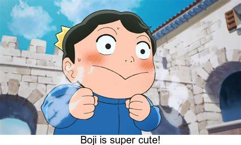

# Index about assignment1
### Motivation
* Boji is **super cute**.
* I would like to expression my angry *without things getting awkward*.


### The origin image


### The new iamge



### Code
I used r code like:
<br>

```
library(magick)
image1 <- image_read("boji.jpeg")
image2 <- image_blank(width =474,height=20,color='white') %>%
  image_annotate(text = 'I am going to explode!',size = 20, gravity = "center")
new_image<-image_append(c(image1,image2),stack=TRUE)
image_write(new_image,'my_meme.png')
```
